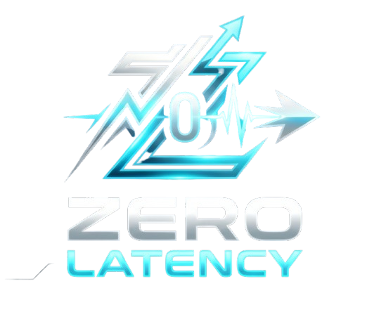

# 🏎️ ZeroLatency - Autonomous AI Racing Agent

<p align="center">
  
</p>

Welcome to the official repository of **Team ZeroLatency**. This project was developed for the **IBM Global AI Racing Competition** as part of the *Artificial Intelligence: Methods and Applications* course at the University of Salerno.

Our project introduces a **Hybrid Autonomous Driving System** capable of achieving highly competitive lap times on the *Corkscrew* circuit in the TORCS simulator. By combining a Deterministic Expert System with Deep Behavioral Cloning, our agent achieved a record autonomous lap time of **1:43**.

## 🧠 Architecture Overview

The system abandons traditional Reinforcement Learning in favor of a robust 3-stage hybrid approach:
1. **Expert System (`collect_data.py`)**: A rule-based bot featuring high-speed PID steering, Traction Control System (TCS), and Anti-lock Braking System (ABS). It plays the game perfectly to generate training data.
2. **Deep Behavioral Cloning (`train_bc.py`)**: A Multi-Head Neural Network (Actor-Critic backbone) trained on the expert's telemetry using a weighted Mean Squared Error (MSE) to prioritize steering accuracy.
3. **Inference Agent (`zl_agent.py`)**: The final deployed agent. It runs the neural network in real-time at ~50Hz, shielded by a deterministic Safety Layer that intervenes only in critical out-of-bound or high-slip scenarios.

### Why not Reinforcement Learning?
Initially, the project included a traditional Reinforcement Learning script (`train_rl.py`). However, RL (specifically PPO) required millions of simulated steps to converge and suffered heavily from *catastrophic forgetting* when facing the harsh Laguna Seca corners. To overcome this, we built a deterministic expert system to generate a perfect "golden" dataset and switched to Behavioral Cloning, which drastically reduced training time and completely eliminated erratic behaviors.

*(Note: We also left `collect_data_manual.py` in the repository for those who wish to try recording telemetry manually using the keyboard arrows, though the Expert System provides far superior datasets).*

---

## 📂 Project Structure

```text
IBM-Race-ZeroLatency/
├── README.md
├── docs/
│   ├── Report_Zero_Latency.pdf     # Official Technical Documentation
│   └── images/
│       └── logoZL.png              # Project Logo
└── src/
    └── gym_torcs/
        ├── dataset/
        │   └── master_dataset.csv  # Telemetry data collected by the Expert System
        ├── models/
        │   ├── bc_model.pth        # Pre-trained Neural Network weights
        │   ├── feat_mean.npy       # Normalization mean values
        │   └── feat_std.npy        # Normalization std values
        └── zl_hybrid/
            ├── collect_data.py         # Deterministic Expert System bot
            ├── collect_data_manual.py  # Manual keyboard telemetry recorder
            ├── train_bc.py             # Behavioral Cloning Training script
            ├── train_rl.py             # Legacy Reinforcement Learning script
            └── zl_agent.py             # Main Autonomous Agent (Inference)
```

---

## ⚙️ Prerequisites & Installation

The project is fully compatible with both **macOS** and **Windows**.

### 1. The Simulator
You must have the customized TORCS simulator installed (`vtorcs-RL-color` with the SCR Server plugin), as provided by the IBM competition guidelines.
- **Mac/Linux:** Built via terminal `make` / `make install`.
- **Windows:** Installed via the provided `.exe` installer.

### 2. Python Environment
Ensure you have Python 3.8 or higher installed. We recommend creating a virtual environment.

Install the required dependencies using `pip`:
```bash
# Core dependencies
pip install torch numpy pandas

# Required only for the Expert System (Data Collection)
pip install pynput
```

*(Note: PyTorch will automatically install the correct backend based on your OS: MPS for Apple Silicon Macs, or CPU/CUDA for Windows).*

---

## 🚀 How to Run the Agent

### Step 1: Start the TORCS Server
1. Launch the TORCS simulator.
2. Navigate to **Race** -> **Quick Race** -> **Configure Race**.
3. Select the **Corkscrew** track.
4. Ensure the **scr_server 1** bot is selected as the driver.
5. Click **New Race** to start the simulation server. The game will pause, waiting for the UDP client.

### Step 2: Launch the AI (Inference)
*Note: The repository already includes our best pre-trained Neural Network weights (`models/bc_model.pth`). You do NOT need to train the model yourself. The agent is ready to race out of the box!*

Open a new terminal (Command Prompt/PowerShell on Windows, or Terminal on Mac), navigate to the root of the repository, and run the main agent script:

```bash
python src/gym_torcs/zl_hybrid/zl_agent.py
```
*The agent will immediately connect to TORCS via UDP and the car will start driving autonomously.*

---

## 🛠 Advanced Usage: Training Your Own Model

If you want to replicate our research from scratch, follow these steps:

### 1. Collect Data
Run the Expert System to generate a flawless telemetry dataset.
```bash
python src/gym_torcs/zl_hybrid/collect_data.py
```
*Let it run for 10-20 laps. It will generate a `master_dataset.csv` file in the `dataset/` folder.*

### 2. Train the Neural Network
Train the Behavioral Cloning Neural Network on the generated dataset.
```bash
python src/gym_torcs/zl_hybrid/train_bc.py
```
*The script will automatically normalize the data, train the model with early stopping, and save the updated weights in the `models/` directory.*

---

## 👥 The Team
- Christian Salvatore Bove
- Marco Michele Dianò
- Miriam Rosanova
- Donato Finiello
- Antonia Lucia Lamberti

**Course:** Artificial Intelligence: Methods and Applications  
**University:** Università degli Studi di Salerno (UNISA)